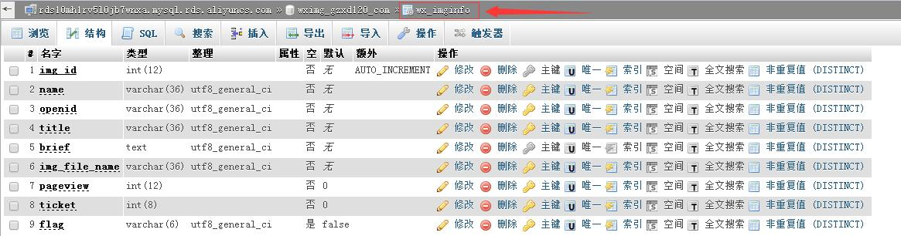
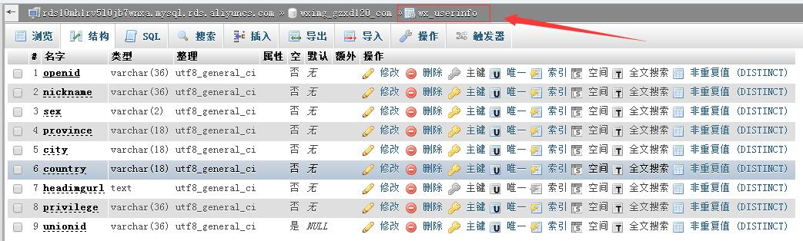
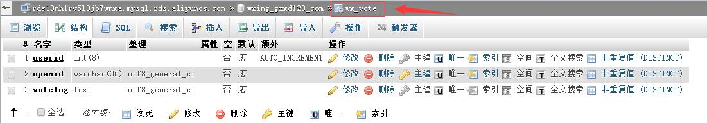

# wechatImg
手机摄影大赛-网站应用

# 功能 #
- 照片上传
- 列表显示作品
- 投票、分享
- 作品修改

# 技术 #
1. MVC开发模式
2. PHP+MySQL
3. 上传前，在前端利用JS对图片进行压缩（/Public/js/localCompress.js）
4. 微信公众平台-微信网页授权（获取用户openid、昵称、头像...）
5. 微信公众平台-微信JS-SDK(定制分享的标题、副标题、链接、图标...)
6. 利用微信openid限定一人投一票
7. 获取当前请求URL存储到cookie中，授权登录并存储用户信息后自动跳转到登录前页面。
8. bootstrap前端布局
9. 使用JQuery向服务器提交ajax投票请求

# MySQL #
数据库中的三个表：

1. wx_imginfo

2. wx_userinfo

3. wx_vote

# Demo #
本项目主要为微信网页开发，Demo只能在微信客户端中打开
[http://wximg.gzxd120.com/](http://wximg.gzxd120.com/)